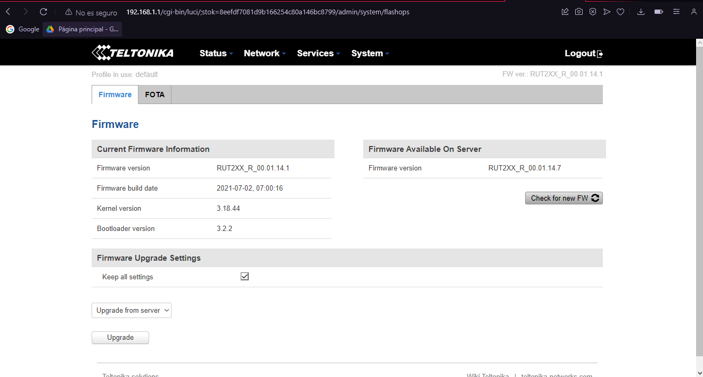

# DESPLIEGUE DE ENTORNO CON MODEM TELTONIKA PARA LA CONEXION CLOUD MEDIANTE OPENVPN

En la siguiente documentació se realizara la conexion mediante una red multisite to multisite con OPENVPN con modems Teltonika - Cloud

# Herramientas necesarias

Antes de proceder con la instalacion del entorno se necesita de las siguientes herramientas previas las cuales son:

- [OPENVPN](https://github.com/angristan/openvpn-install#faq)
- [RUT2_R_00.07.06.6_WEBUI.bin](https://wiki.teltonika-networks.com/view/RUT240_Firmware_Downloads) 
  > **NOTA** Esta es la actualizacion del Firmware a la ultima version del proveedor se recomienda la actualizacion para tener todos los paquetes necesarios para realizar el montaje

# Requisitos de maquina

Requisitos minimos para la instalacion

| Estructura       | Valores           |
|------------------|-------------------|
|OS usado          | Ubuntu 20.04 LTS  |
|vCPU              | 2                 |
|RAM (GB)          | 4                 |
|Disk (GB)         | 10                |
|Home user         | ubuntu            |
|Number of NICs    | 1 (ens160)        |
|OPENVPN           | v 3.0.1           |

> **NOTA** Se requiere tener una ip publica en la maquina donde se montara el servidor vpn, el cual requiere tener acceso a internet

# Instalacion del entorno en la VM

Se instala el servicio de OPENVPN con la siguiente linea de comandos

```bash
sudo apt update
sudo apt upgrade
sudo apt install openvpn
```
se procede a instalar el servidor de OpenVPN en la maquina haciendo uso del respositro de github

```bash
curl -O https://raw.githubusercontent.com/angristan/openvpn-install/master/openvpn-install.sh
chmod +x openvpn-install.sh
./openvpn-install.sh
```
Se asignara el nombre del primer cliente con el cual se cargara el archivo OpenVPN al modem teltonika

Ya con esto se tendria el servidor para emepezar el enrutamiento con los clientes, cada vez que se desee generar un cliente se ejecuta la line `./openvpn-install.sh` y se selecciona adicionar cliente.

En el modem se muestra la siguiente interfaz


> **NOTA** La ip por defecto para acceder es la 192.168.1.1 con mascara 255.255.255.0, el usuario es admin y la contraseña admin01

Al realizar el loggeo nos pediran cambiar la contraseña, al acceder al modem buscaremos la interfaz de system, firmware en la cual tendremos por defecto la `RUT2XX_R_00.01.14.7`, esta dependera del instrumento que se este usando.

En el apartado de Firmware Upgrade Settings, se seleccionara Upgrade from server y se realizara un Upgrade, con ello se pretende realizar una pequeña actualizacion para que el intrumento pueda reconocer el archivo .bin con la ultima version del fabricante.


