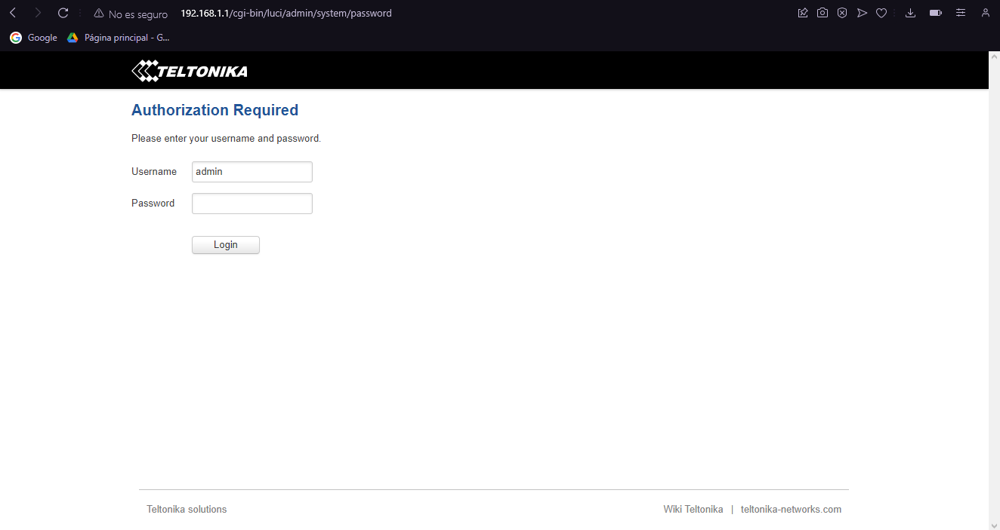
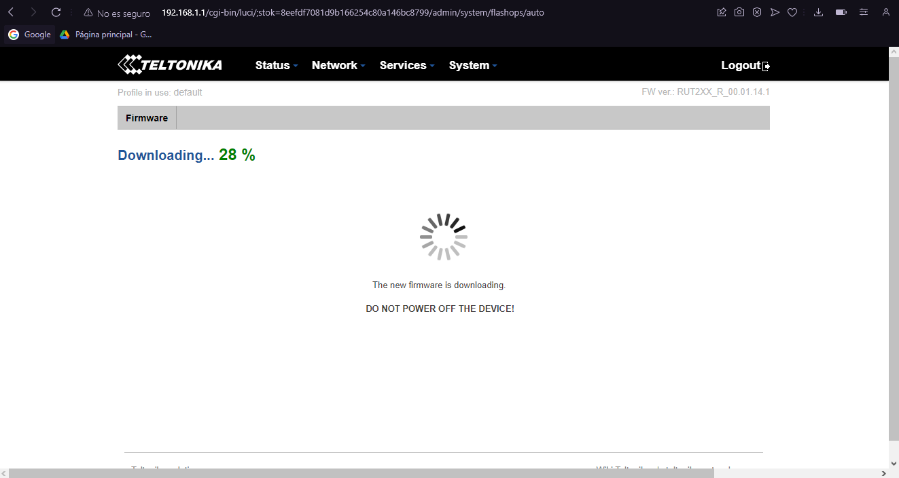
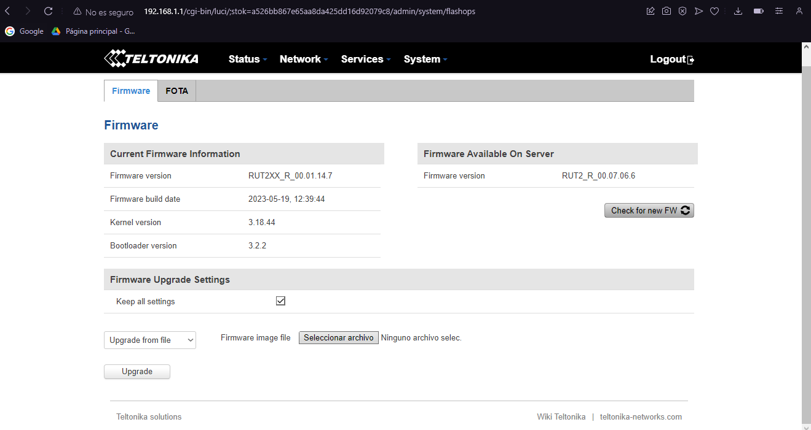
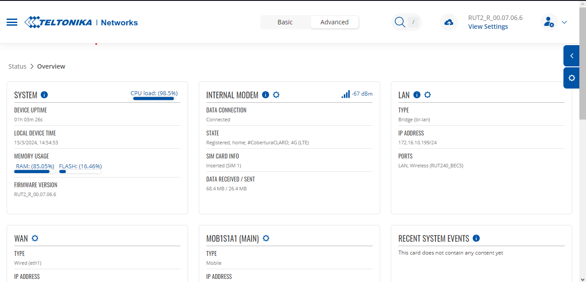
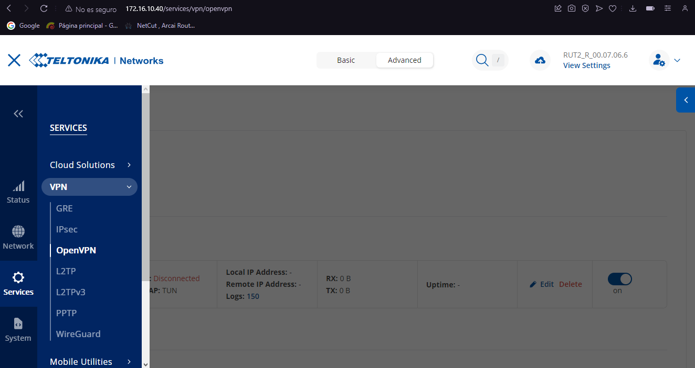
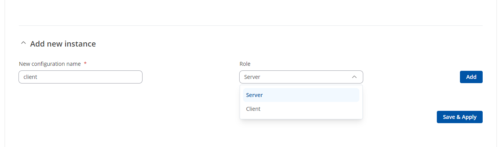
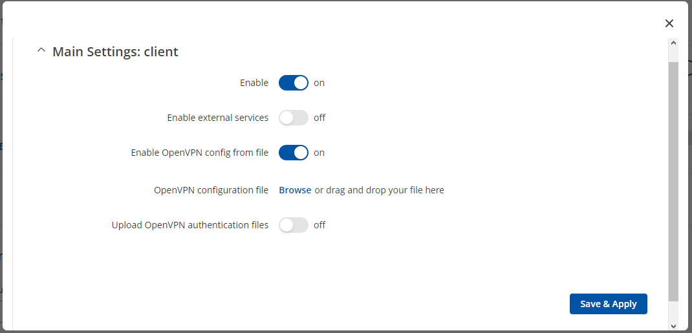

# DESPLIEGUE DE ENTORNO CON MODEM TELTONIKA PARA LA CONEXION CLOUD MEDIANTE OPENVPN

En la siguiente documentació se realizara la conexion mediante una red multisite to multisite con OPENVPN con modems Teltonika - Cloud

# Herramientas necesarias

Antes de proceder con la instalacion del entorno se necesita de las siguientes herramientas previas las cuales son:

- [OPENVPN](https://github.com/angristan/openvpn-install#faq)
- [RUT2_R_00.07.06.6_WEBUI.bin](https://wiki.teltonika-networks.com/view/RUT240_Firmware_Downloads) 
  > **NOTA** Esta es la actualizacion del Firmware a la ultima version del proveedor se recomienda la actualizacion para tener todos los paquetes necesarios para realizar el montaje

# Requisitos de maquina

Requisitos minimos para la instalacion

| Estructura       | Valores           |
|------------------|-------------------|
|OS usado          | Ubuntu 20.04 LTS  |
|vCPU              | 2                 |
|RAM (GB)          | 4                 |
|Disk (GB)         | 10                |
|Home user         | ubuntu            |
|Number of NICs    | 1 (ens160)        |
|OPENVPN           | v 3.0.1           |

> **NOTA** Se requiere tener una ip publica en la maquina donde se montara el servidor vpn, el cual requiere tener acceso a internet

# Instalacion del entorno en la VM

Se instala el servicio de OPENVPN con la siguiente linea de comandos

```bash
sudo apt update
sudo apt upgrade
sudo apt install openvpn
```
se procede a instalar el servidor de OpenVPN en la maquina haciendo uso del respositro de github

```bash
curl -O https://raw.githubusercontent.com/angristan/openvpn-install/master/openvpn-install.sh
chmod +x openvpn-install.sh
./openvpn-install.sh
```
Se asignara el nombre del primer cliente con el cual se cargara el archivo OpenVPN al modem teltonika

Ya con esto se tendria el servidor para emepezar el enrutamiento con los clientes, cada vez que se desee generar un cliente se ejecuta la line `./openvpn-install.sh` y se selecciona adicionar cliente.

En el modem se muestra la siguiente interfaz


> **NOTA** La ip por defecto para acceder es la 192.168.1.1 con mascara 255.255.255.0, el usuario es admin y la contraseña admin01

Al realizar el loggeo nos pediran cambiar la contraseña, al acceder al modem buscaremos la interfaz de system, firmware en la cual tendremos por defecto la `RUT2XX_R_00.01.14.7`, esta dependera del instrumento que se este usando.

En el apartado de Firmware Upgrade Settings, se seleccionara Upgrade from server y se realizara un Upgrade, con ello se pretende realizar una pequeña actualizacion para que el intrumento pueda reconocer el archivo .bin con la ultima version del fabricante.


Actualizacion de software



Al culminar la actualizacion se tendra que realizar el mismo proceso pero se seleccionara en el apartado de Firmware Upgrade Settings, Upgrade from file, y se cargara el archivo `RUT2_R_00.07.06.6_WEBUI.bin` que se descargo previamente de los links proporcionados al principio de esta documentacion



Con ello se tendra con la ultima version del proveedor y se puede continuar con la configuracion de la vpn en los dispositivos



# Configuración de enrutamiento en el modem



En Add new instance, se asignara el nombre que se desee, y en role se pondra client, se añade la red y se procede habilitar la interfaz a su vez la opcion para cargar archivos de OpenVPN, se selecciona el archivo y posteriormente se cargara.





De igual forma se realizara el procedimiento para los demas equipos que se requieran agregar a la red.

> **NOTA** Habilitar los puertos para la VPN el cual es UDP o TCP en el 443

# Instalacion de entorno rdp para ubuntu

Para tener una interfaz visual de ubuntu en una maquina que se encuentre en una cloud, se requiere como primer paso habilitar los puertos de entrada y salida, en este caso 3389, con ello se ingresan los siguiente comandos en la maquina

```bash
sudo apt install ubuntu-desktop  # instando el entorno de escritorio
sudo apt install -y xrdp # instalando el servicio rdp
sudo apt install -y xfce4 # instalando complementos de rdp
sudo service xrdp restart # se restablece el servicio
```
Con esto ya se tendria el entorno visual para ser usado, por ultimo se cambiara la contraseña de supor usario `root` 

```bash
sudo su
passwd # se pondra contraseña que desee
```
